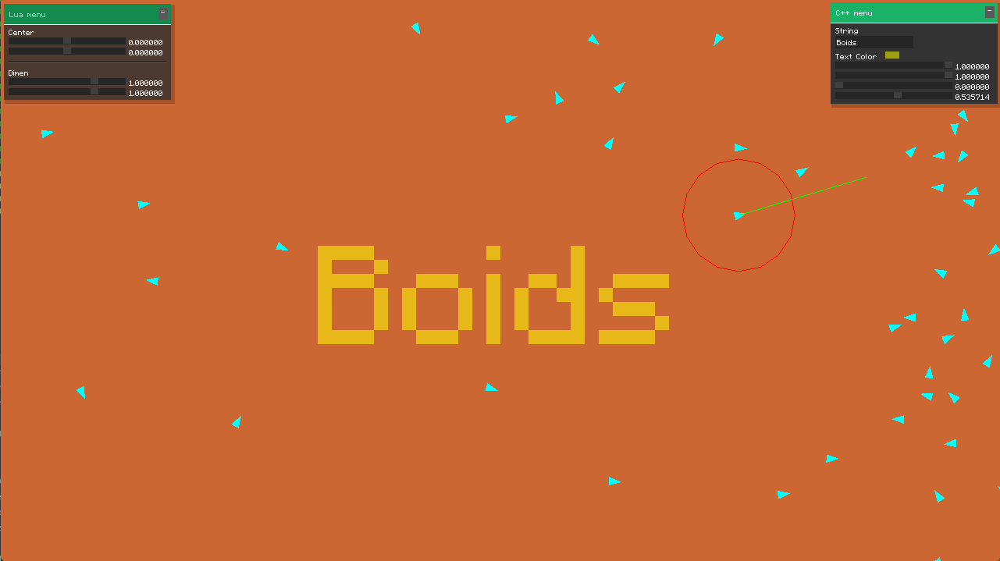

# GameEngine
A simple cross platform Game Engine. Currently it has basic support for scripting and has two rendering APIs (i.e. OpenGL and DirectX).
If you want to checkout my other engine go here: https://github.com/anujv99/2DEngine/

Some Key Features:
* Cross Platform
* OpenGL, DirectX 11
* Custom immediate mode GUI
* Scripting using LUA
* and many more to come...

# Build Process

* clone using ``` git clone --recurse-submodules https://github.com/anujv99/GameEngine ```
* ``` cd GameEngine ```
* Now the process can vary from platform to platform. Basically it's a CMake project, so you
  can use your preferred toolset to build it.
* For example, If you are using Visual Studio:
* Simply onen the `GameEngine' folder in Visual Studio
* Set the startup project to Sandbox and Run.

# Screenshots



# Notes

The scripting support is very basic at the moment. So, in order to develop anything
simply use the Sandbox application for now.
